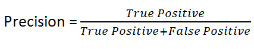
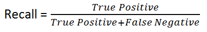

# ML-Project-4-Exoplanets

#### Project Goal

The goal of this project was to predict potential exoplanets that are earth-size and smaller within the habitable zone of their respective sun using a variety of classification models.

#### Conclusion

Under normal circumstances I would only report one model, whether it be an ensemble of models or one classification model but I was curious on what my best two models would predict and how differnet they were when it comes to predicting unseen candidate data.

After extracting 2418 candidates, I used my best two models to classify them.
* SVC predicted there would be 910 potential earth-sized and smaller exoplanets within the habitable zone
* Random Forest predicted there would be 818 potential earth-sized and smaller exoplanets within the habitable zone

If I was part of NASA's team that is involved in the Kepler's mission, I would attempt to validate the candidates my models predicted. 

# Final thoughts 

The models and their final **recall** performance was;
* Logistic Regression (86%)
* KNN (89%)
* Decision Tree (84%)
* Random Forest (90%)
* SVM (91%)

#### Data Source

This dataset was obtained by [California Institute of Technology (Caltech)](https://exoplanetarchive.ipac.caltech.edu/index.html) which hosted NASA's exoplant archive. 
This dataset has the most accurate and updated dispositions, stellar, and planetary information. 

#### Data Description

Please visit the [Caltech documentation](https://exoplanetarchive.ipac.caltech.edu/docs/API_kepcandidate_columns.html) to understand what each column/feature entails. 

#### Metrics

Why recall out of other classification metrics (F1, Accuracy, Precision)?? 

The objective of this project was to detect potential exoplanets from the list of canadidates. The assumption I am going to make, if I was the leader of this project, is that I want to make sure to **capture all potenial planets** (to be on the safe side) at the cost of having false positive (predicting positive but was actually negative) which affects cost, time, and energy to investigate the candidates. We want to low the false negative. 

Accuracy is often good to use if the label class is balance. This data set that was used to train the model did not have a balanced label (2:1). 

F1 is the harmonic mean of precision and recall. It is oftenly used for the punishing extreme difference between precision and recall. 

By taking a look at precision, we can see that the metric is influence by false positive.  With that being said, I would use precision if the condition for the objective was that we care about the resourses spent instead of capturing all potential candidates (lowering of false negative). 

 

Recall is affected by the false negative. We want to lower false negative to avoid the high cost associated with the consequences (negatively impacting the objective).
