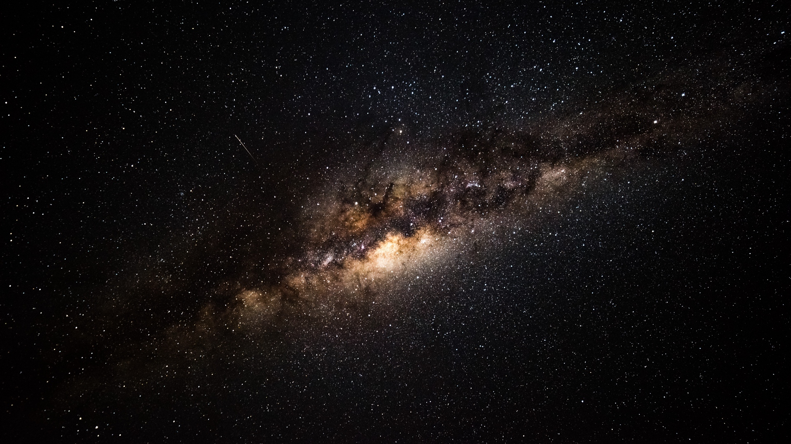

# ML-Project-3-Exoplanets

  

#### Conclusion

I used my best two models to classify the candidates!
* SVC predicted there would be 994 potential earth-sized and smaller within the habitable zone!
* Random Forest prediced there would be 829 potential earthh-sized and smaller within the habitable zone! 

Models and their final performance was;
* Logistic Regression (87%)
* KNN (86%)
* Decision Tree (84%)
* Random Forest (89%)
* SVM (90%)

#### Project Goal

The goal of this project is to predict potential Exoplanets that are earth-size and smaller within the habitable zone of their respective sun using a variety of classification models.

#### Data Source

This dataset was obtained by [California Institute of Technology (Caltech)](https://exoplanetarchive.ipac.caltech.edu/index.html) which hosted NASA's exoplant Archive. 
This dataset has the most accurate and updated dispositions and stellar and planetary information. 

#### Data Description

Please view [Caltech documentation](https://exoplanetarchive.ipac.caltech.edu/applications/DocSet/index.html?doctree=/docs/docmenu.xml&startdoc=1) page to understand what each column/feature entails. 

