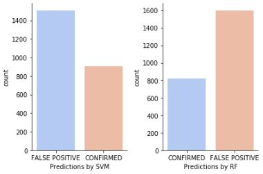

# ML-Project-4-Exoplanets

#### Project Goal

The goal of this project was to predict potential exoplanets that are earth-size and smaller within the habitable zone of their respective sun using a variety of classification models.

#### Conclusion

After extracting 2418 candiates, I used my best two models to classify the 2418 candidates.
* SVC predicted there would be 994 potential earth-sized and smaller exoplanets within the habitable zone
* Random Forest predicted there would be 829 potential earth-sized and smaller exoplanets within the habitable zone

Models and their final performance was;
* Logistic Regression (87%)
* KNN (86%)
* Decision Tree (84%)
* Random Forest (89%)
* SVM (90%)

#### Data Source

This dataset was obtained by [California Institute of Technology (Caltech)](https://exoplanetarchive.ipac.caltech.edu/index.html) which hosted NASA's exoplant archive. 
This dataset has the most accurate and updated dispositions, stellar, and planetary information. 

#### Data Description

Please visit [Caltech documentation](https://exoplanetarchive.ipac.caltech.edu/applications/DocSet/index.html?doctree=/docs/docmenu.xml&startdoc=1) to understand what each column/feature entails. 

